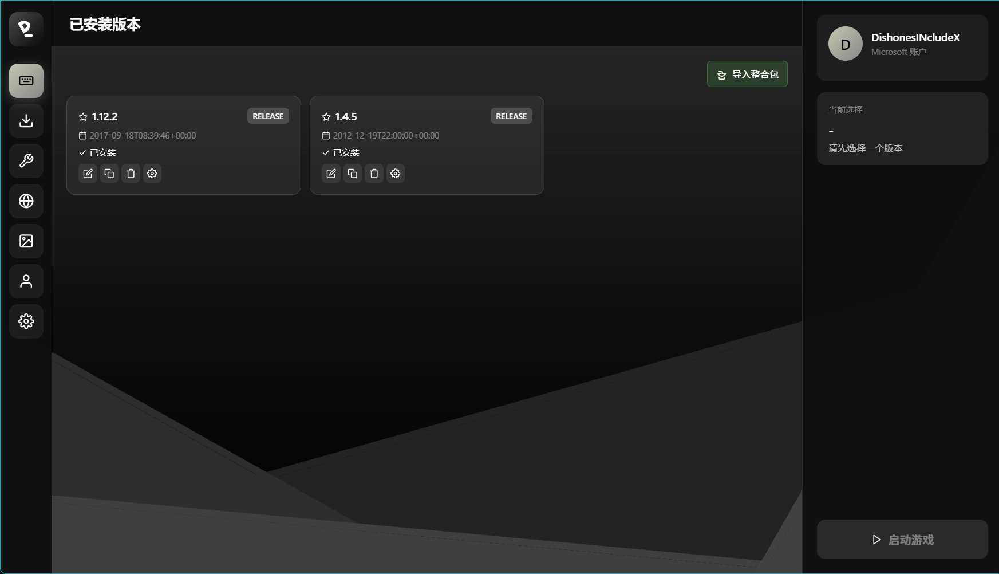

# DevLauncher

一个用 Python 构建的 Minecraft 启动器，面向模组开发者和整合包制作者。

English below.

---

## 功能

- **微软账号登录** — OAuth2 认证，支持刷新令牌持久化
- **版本管理** — 安装、删除、切换 Minecraft 版本，支持版本隔离
- **模组加载器** — 一键安装 Fabric、Forge、NeoForge、Quilt、OptiFine，自动备份原版 JSON
- **模组管理** — 从 Modrinth / CurseForge 搜索、安装、删除模组，支持版本隔离目录
- **整合包导入** — 支持 Modrinth (.mrpack)、CurseForge (.zip)、MultiMC 格式，自动识别 client-overrides
- **游戏启动** — 基于 minecraft-launcher-lib，支持自定义内存、Java 路径、JVM 参数
- **主题系统** — 可自定义主色调和渐变色，实时预览
- **离线登录** — 无需账号即可启动

## 截图



## 安装

需要 Python 3.10+。

```bash
pip install -r requirements.txt
```

依赖：
- `minecraft-launcher-lib` ≥ 8.0.0
- `PyQt6` ≥ 6.6.0
- `PyQt6-WebEngine` ≥ 6.6.0
- `requests` ≥ 2.31.0
- `psutil` ≥ 5.9.0

## 运行

```bash
python main.py
```

## 项目结构

```
DevLauncher/
├── main.py                     # 入口，PyQt6 窗口 + QWebChannel 桥接
├── launcher_core/
│   ├── auth.py                 # 微软 OAuth2 认证
│   ├── game.py                 # 游戏启动、进程管理
│   ├── mod_manager.py          # 模组搜索、安装、删除
│   ├── modpack_importer.py     # 整合包导入（Modrinth/CurseForge/MultiMC）
│   ├── versions.py             # 版本列表、安装状态
│   ├── settings.py             # 用户设置持久化
│   ├── api_modrinth.py         # Modrinth API
│   ├── api_curseforge.py       # CurseForge API
│   └── api_modloaders.py       # Fabric/Forge/NeoForge 安装
├── ui/
│   ├── index.html              # 前端界面（HTML/CSS/JS）
│   ├── icon.svg                # 应用图标
│   └── icon-modpack-import.svg # 导入整合包图标
└── requirements.txt
```

## 技术细节

- 前端通过 QWebChannel 与 Python 通信，JS 调用 Python 方法，Python 通过信号推送状态
- 所有阻塞操作（下载、安装、API 请求）在 daemon 线程中执行，不冻结 UI
- 整合包导入支持 `overrides/` 和 `client-overrides/` 两种目录结构
- 模组加载器安装时自动备份原版 JSON 为 `devlauncher.vanilla.json`
- 版本隔离模式下，模组存储在 `versions/<version>/mods/`，启动时通过 `--gameDir` 指定

## 已知问题

- CurseForge 下载需要 API Key
- 部分旧版 Forge 安装器（MC < 1.13）使用不同的库结构


---

# DevLauncher

A Minecraft launcher built with Python, designed for mod developers and modpack creators.

## Features

- **Microsoft Account Login** — OAuth2 authentication with token persistence
- **Version Management** — Install, delete, switch Minecraft versions with per-version isolation
- **Mod Loaders** — One-click install for Fabric, Forge, NeoForge, Quilt, OptiFine with vanilla JSON backup
- **Mod Management** — Search, install, delete mods from Modrinth / CurseForge with version-isolated directories
- **Modpack Import** — Supports Modrinth (.mrpack), CurseForge (.zip), MultiMC formats; auto-detects client-overrides
- **Game Launch** — Based on minecraft-launcher-lib; custom memory, Java path, JVM args
- **Theme System** — Customizable accent color and gradients with live preview
- **Offline Login** — Play without an account

## Installation

Requires Python 3.10+.

```bash
pip install -r requirements.txt
```

Dependencies:
- `minecraft-launcher-lib` ≥ 8.0.0
- `PyQt6` ≥ 6.6.0
- `PyQt6-WebEngine` ≥ 6.6.0
- `requests` ≥ 2.31.0
- `psutil` ≥ 5.9.0

## Usage

```bash
python main.py
```

## Project Structure

```
DevLauncher/
├── main.py                     # Entry point, PyQt6 window + QWebChannel bridge
├── launcher_core/
│   ├── auth.py                 # Microsoft OAuth2 authentication
│   ├── game.py                 # Game launch, process management
│   ├── mod_manager.py          # Mod search, install, delete
│   ├── modpack_importer.py     # Modpack import (Modrinth/CurseForge/MultiMC)
│   ├── versions.py             # Version list, install state
│   ├── settings.py             # User settings persistence
│   ├── api_modrinth.py         # Modrinth API
│   ├── api_curseforge.py       # CurseForge API
│   └── api_modloaders.py       # Fabric/Forge/NeoForge installation
├── ui/
│   ├── index.html              # Frontend (HTML/CSS/JS)
│   ├── icon.svg                # App icon
│   └── icon-modpack-import.svg # Import modpack icon
└── requirements.txt
```

## Technical Details

- Frontend communicates with Python via QWebChannel; JS calls Python methods, Python pushes state via signals
- All blocking operations (downloads, installs, API calls) run in daemon threads to keep the UI responsive
- Modpack import handles both `overrides/` and `client-overrides/` directory structures
- Mod loader installs automatically back up the vanilla JSON as `devlauncher.vanilla.json`
- In version isolation mode, mods are stored in `versions/<version>/mods/` and launched with `--gameDir`

## Known Issues

- CurseForge downloads require an API key
- Some old Forge installers (MC < 1.13) use a different library structure
